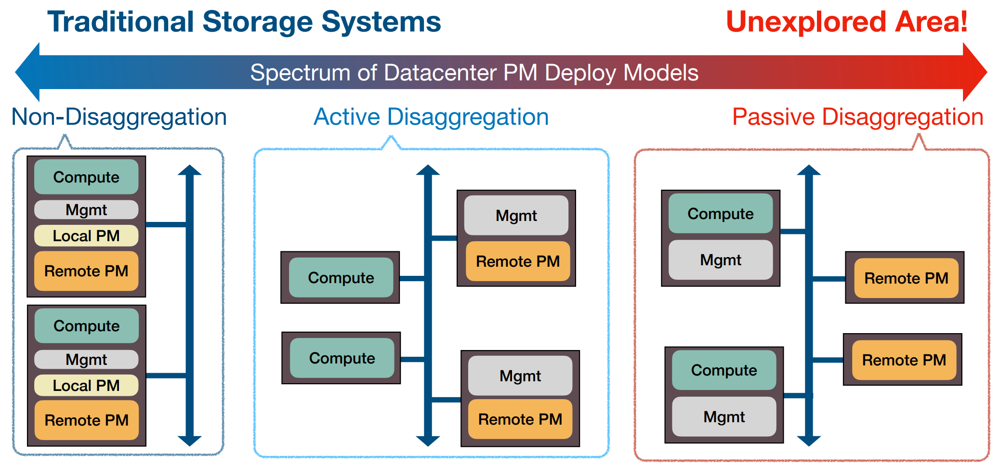
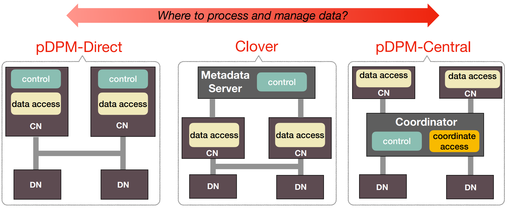

<p align="center">

</p>

__Passive Disaggregated Persistent Memory (pDPM) at USENIX ATC 2020__

[**[USENIX ATC 2020 Paper]**](https://www.usenix.org/conference/atc20/presentation/tsai)  &nbsp;
[**[Slide]**](./Documentation/ATC20-pDPM-slides.pdf)  &nbsp;
[**[Slide-Short]**](./Documentation/ATC20-pDPM-slides-short.pdf) &nbsp;
[**[Talk]**](https://www.usenix.org/conference/atc20/presentation/tsai)

## pDPM Model

We explore an alternative approach of building Disaggregated Persistent Memory (DPM) by treating storage nodes as _passive_ parties that do not perform any data processing or data management tasks, a model we call Passive Disaggregated Persistent Memory, or __pDPM__.

pDPM lowers owning and energy cost, also avoids storage node being the processing scalability bottleneck. pDPM is an instance of _passive disaggregation_ approach and has largely been overlooked in the past. Our work does a thorough exploration of this area.

<p align="center">

</p>

## pDPM-based Key-Value Stores

Based on where to process and manage data, we build three pDPM-based key-value stores: pDPM-Direct, pDPM-Cental, and Clover. All of them provide GET/PUT interfaces and have been tested against YCSB workload.

<!-- Both pDPM-Direct and pDPM-Central are developed based on [HERD](https://github.com/efficient/rdma_bench/tree/master/herd). -->

<p align="center">

</p>

## Classification 

pDPM is an architecture, which could support many types of usages and applications.
The KVS is just one way of utilizing pDPM architecture.
It is also possible to build a system on top of pDPM architecture that simply exposes memory interface,
it is also possible build a more complex system exposing, e.g., SQL interface.

## Tutorial

All systems in this repository are _userspace_ programs, hence no special kernel modifications are necessary. All of them run on top of any popular Linux distributions with the following dependencies:
- libibverbs
- memcached
- numactl
- C++ boost coroutine

For hardware, each machine should have a RDMA NIC card (e.g., Mellanox ConnectX-5) and connected via a Infiniband or Ethernet switch. All systems are able to run on both RoCE and Infiniband mode. If you do not have such testbed, consider using [CloudLab](https://www.cloudlab.us/).

The testing flow of all systems is almost the same: a) start a server instance, b) start a set of simulated passive memory instances, and c) start a set of compute instances. All systems use memcached as a centralized metadata store to exchange QP number and RKEY information.

Clover is a vanilla development effort. pDPM-Central and pDPM-Direct are built on top of a high-performance two-sided KVS called [HERD](https://github.com/efficient/rdma_bench/tree/master/herd). For setup tutorials, please refer to the following documents:
- [Clover](./Documentation/clover.md)
- [Central](./Documentation/central.md)
- [Direct](./Documentation/direct.md)

**The entire code base was designed and implemented by [Dr. Shin-Yeh Tsai](https://www.cs.purdue.edu/homes/tsai46/) during his doctoral research at Purdue University.**

## Contact

[Shin-Yeh Tsai](https://www.cs.purdue.edu/homes/tsai46/),
[Yizhou Shan](http://lastweek.io),
[Yiying Zhang](https://cseweb.ucsd.edu/~yiying/).

For more disaggregation-related research, make sure to check out our publication list at [WukLab.io](http://wuklab.io).

## Cite

To cite our pDPM paper, please consider using the following bibtex:

```
@inproceedings {ATC20-pDPM,
title = {{Disaggregating Persistent Memory and Controlling Them Remotely: An Exploration of Passive Disaggregated Key-Value Stores}},
author = {Shin-Yeh Tsai and Yizhou Shan and Yiying Zhang},
booktitle = {2020 {USENIX} Annual Technical Conference ({USENIX} {ATC} 20)},
year = {2020},
url = {https://www.usenix.org/conference/atc20/presentation/tsai},
publisher = {{USENIX} Association},
month = jul,
}
```
